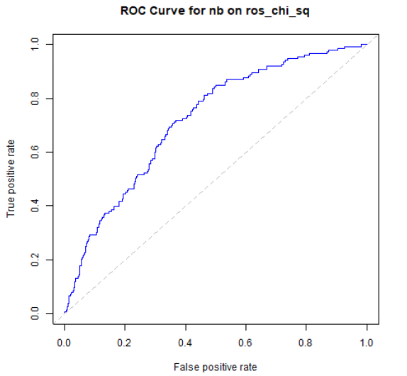

# 🏥 Predicting Cancer Using Classification Machine Learning Models

## 📌 Project Overview
This project involves **data preparation, data balancing, feature selection, and classification model building** to predict cancer diagnoses using the **2019 Behavioral Risk Factor Surveillance System (BRFSS)** survey data from the CDC. The objective is to develop **machine learning models** that classify individuals based on their health attributes and determine the best-performing model for cancer prediction.

## 📂 Table of Contents
- [Introduction](#introduction)
- [Key Results Summary](#key-results-summary)
- [Data Preprocessing](#data-preprocessing)
- [Data Balancing](#data-balancing)
- [Feature Selection](#feature-selection)
- [Classification Models](#classification-models)
- [Performance Metrics](#performance-metrics)
- [Hyperparameter Tuning](#hyperparameter-tuning)
- [Ensemble Method](#ensemble-method)
- [Conclusion & Future Improvements](#conclusion--future-improvements)

---

## 📖 Introduction
### 🎯 **Goal**
- Predict cancer diagnoses using **machine learning classification models**.
- Evaluate different **feature selection and data balancing techniques** to improve model performance.
- Use **ensemble methods** to further refine predictions.

### 📊 **Dataset**
- **Source**: [2019 Behavioral Risk Factor Surveillance System (BRFSS)](https://www.cdc.gov/brfss/annual_data/annual_2019.html)
- **Target Variable**: Whether an individual was ever told they had cancer (**Y = Yes, N = No**).

---

## ⭐ Key Results Summary
- **Best Model**: **Naive Bayes** on the `ros_chi_sq` dataset (**Random Over-Sampling + Chi-Square Feature Selection**).
- **True Positive Rate (TPR)**:
  - **Class 0 (No Cancer)**: **67%**
  - **Class 1 (Cancer Diagnosis)**: **64%**
- **Weighted AUC**: **0.72**

---

## 🔧 Data Preprocessing
Data preprocessing involved multiple steps:

1️⃣ **Data Cleaning**
   - Removed **unnecessary columns**.
   - Handled **missing values** (`KNN` for numeric, `mode` for categorical, `median` for ordinal).
   - Standardized numeric attributes (e.g., weight, height) using **Min-Max Scaling**.
   - Encoded the **target variable** (`Y = 1`, `N = 0`).

2️⃣ **Outlier Treatment**
   - **Interquartile Range (IQR)** method used for capping outliers.

3️⃣ **Data Splitting**
   - **80-20 split** for **training & testing datasets**.
   - Verified **no missing values or duplicated records** after splitting.

---

## ⚖️ Data Balancing
To address class imbalance, two techniques were applied:

- **Random Over-Sampling (ROS)**: Increases the minority class to match the majority class.
- **Random Under-Sampling (RUS)**: Decreases the majority class to match the minority class.

### 🔢 **Class Distribution After Balancing**
- **ROS**: **Class 0 = 3315**, **Class 1 = 3315**
- **RUS**: **Class 0 = 685**, **Class 1 = 685**

⚠️ **Caution:** Data balancing may introduce bias towards synthetic data, but unbalanced data can lead to models favoring the majority class. Performance was evaluated thoroughly using **unseen test data** to ensure fairness.

---

## 🏆 Feature Selection
To improve **classification performance**, multiple feature selection methods were used:

- **Recursive Feature Elimination (RFE)**
- **Random Forest Importance**
- **Information Gain**
- **Boruta**
- **Chi-Squared Test**

### 📊 **Class Distribution After Feature Selection**
| Dataset | Class 0 | Class 1 |
|---------|---------|---------|
| `ros_boruta_features` | 6630 | 140 |
| `ros_chi_sq_features` | 6630 | 51 |
| `rus_chi_sq_features` | 1370 | 51 |

---

## 🏗️ Classification Models
Six different **machine learning classification models** were implemented:

1. **Logistic Regression (GLM)**
2. **Decision Tree (RPART)**
3. **Support Vector Machine (SVM)**
4. **Random Forest (RF)**
5. **Naive Bayes (NB)**
6. **K-Nearest Neighbors (KNN)**

Performance metrics were stored as **CSV files** for future analysis.

---

## 📊 Performance Metrics
### 🔥 **Best Model: Naive Bayes on `ros_chi_sq` Dataset**
| Metric       | Class 0 | Class 1 | Weighted Avg |
|-------------|---------|---------|-------------|
| **TPR**     | 0.613  | 0.712  | 0.628 |
| **FPR**     | 0.287  | 0.387  | 0.303 |
| **Precision** | 0.922  | 0.250  | 0.819 |
| **Recall**  | 0.613  | 0.712  | 0.629 |
| **F1-Score** | 0.737  | 0.370  | 0.681 |
| **AUC**     | 0.717  | 0.717  | 0.717 |

### 🔎 **Confusion Matrix**
|               | Predicted Class 0 | Predicted Class 1 |
|---------------|-------------------|------------------|
| **Actual Class 0** | 519 | 44 |
| **Actual Class 1** | 327 | 109 |

📈 **ROC Curve for Naive Bayes (`ros_chi_sq` dataset)**



---

## 🎛 Hyperparameter Tuning
To optimize model performance, **10-fold cross-validation** was used.

🔹 **Tuned Models & Parameters:**
- **Random Forest** (`mtry`)
- **Naive Bayes** (`fL`, `usekernel`, `adjust`)
- **Support Vector Machine** (`C`, `sigma`)
- **K-Nearest Neighbors** (`kmax`, `distance`)

📉 **Impact:** Despite tuning, **no significant improvements** were observed, confirming that initial configurations were already optimized.

---

## 🏆 Ensemble Method (Stacking)
An **ensemble method** was employed using **Naive Bayes, Random Forest, and Logistic Regression**.

🚀 **Meta-Model Performance**
| Metric       | Class 0 | Class 1 | Weighted Avg |
|-------------|---------|---------|-------------|
| **TPR**     | 0.667  | 0.641  | 0.663 |
| **Precision** | 0.911  | 0.258  | 0.811 |
| **AUC**     | 0.705  | 0.705  | 0.705 |

🛑 **Conclusion**: The **ensemble model did not outperform the Naive Bayes model**, confirming that **simpler models worked best** for this dataset.

---

## 🏁 Conclusion & Future Improvements
✅ **Key Takeaways**
- The **Naive Bayes model** performed best (**AUC = 0.72**).
- **Feature selection & data balancing** significantly impacted model performance.
- **Hyperparameter tuning & ensemble learning** did not yield substantial improvements.

🚀 **Next Steps**
- Explore **deep learning models (Neural Networks)**.
- Investigate **non-linear feature transformations**.
- Apply **feature aggregation techniques** to improve predictive power.

📌 **Challenge**: Finding the **optimal model** is like climbing a mountain—you don’t know which path leads to the peak until you try!

---

## 🔧 Installation & Usage
```bash
git clone https://github.com/ericylc23/Predicting-Cancer-ML.git
cd Predicting-Cancer-ML
pip install -r requirements.txt
jupyter notebook
```

## Contact
For questions or collaborations, please reach out to me via:
```bash
📧 Email: ericylc@bu.edu 
🔗 LinkedIn: https://www.linkedin.com/in/eric-yuanlc/
```
🌟 If you found this project useful, don’t forget to ⭐ star the repo!
